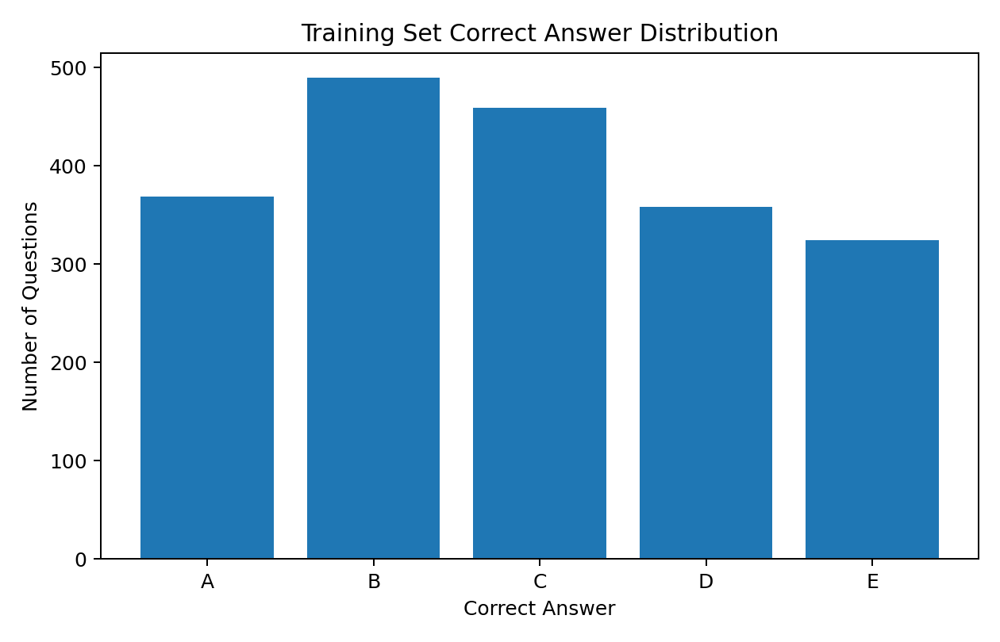
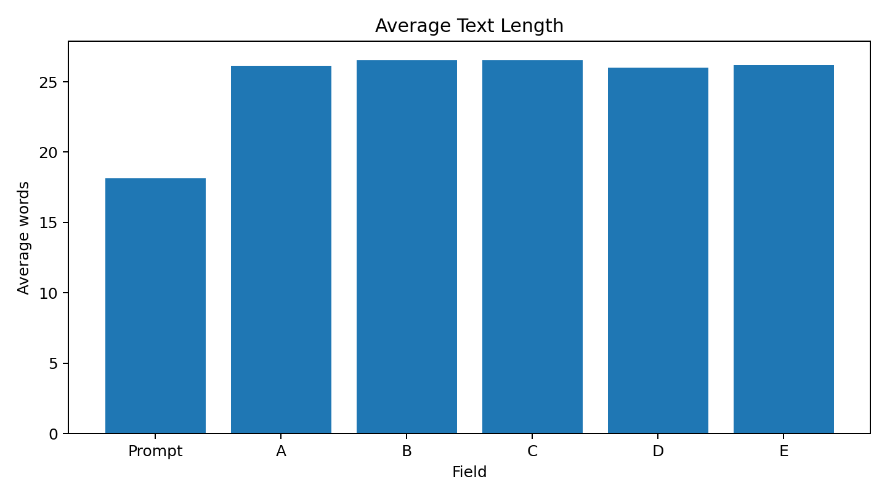

# Smart MCQ Solver — Deep Learning & Generative AI

**IIT Madras BS Data Science | Deep Learning & Generative AI Project | Kaggle Competition**

An AI-based multiple-choice question answering project developed for the **Smart MCQ Solver Challenge**. The system explores multiple machine-learning and transformer-based approaches to rank the three most likely answers for each question.

> **Project status: Completed and passed the required project evaluation.**

## 🎯 Problem

Each question contains:

- A question prompt
- Five possible answers: **A, B, C, D, E**

The task is to predict the **top three answers in ranked order**.

The competition evaluates submissions using **Mean Average Precision at 3 (MAP@3)**, which rewards placing the correct answer earlier in the ranked list.

## 📊 Dataset

The competition data used during development contains:

| Split | Rows | Columns |
|---|---:|---:|
| Training | 2,000 | 8 |
| Test | 500 | 7 |

Training columns:

```text
id, prompt, A, B, C, D, E, answer
```

Test columns:

```text
id, prompt, A, B, C, D, E
```

### Data quality

The supplied dataset was checked for:

- Missing values: **0**
- Duplicate rows: **0**

The full competition CSV files are **not included in this public repository**. See [`data/README.md`](data/README.md) for dataset details.

## 🧠 Approaches Explored

### 1. TF-IDF + PyTorch Neural Network

The prompt and five answer choices were combined into a text representation and converted into TF-IDF features.

Architecture:

```text
TF-IDF
   ↓
Linear(12166 → 512)
   ↓
ReLU + Dropout(0.3)
   ↓
Linear(512 → 256)
   ↓
ReLU + Dropout(0.3)
   ↓
Linear(256 → 5)
   ↓
Scores for A–E
   ↓
Top-3 ranking
```

Configuration:

- TF-IDF maximum features: 20,000
- N-gram range: 1–2
- PyTorch
- Cross-Entropy Loss
- Adam optimizer
- Learning rate: 0.001
- Batch size: 32
- Epochs: 5

### 2. MiniLM Semantic Similarity

The pretrained `all-MiniLM-L6-v2` Sentence Transformer was used to create embeddings for:

1. The question prompt
2. Each answer option

Cosine similarity between the prompt embedding and each option embedding was used to rank the answers.

### 3. MPNet Semantic Similarity

The pretrained `all-mpnet-base-v2` model was evaluated using the same embedding-and-similarity strategy.

## 📈 Experimental Results

The notebook contains the following experimental diagnostics:

| Approach | Result |
|---|---:|
| TF-IDF + PyTorch Neural Network | 100% training accuracy by epoch 2 |
| MiniLM (`all-MiniLM-L6-v2`) | 26.1% training top-1 accuracy |
| MPNet (`all-mpnet-base-v2`) | 25.9% training top-1 accuracy |

**Important:** these are development diagnostics, not the official Kaggle leaderboard score. The competition's official metric is **MAP@3**.

## 🔎 Dataset Analysis

### Correct-answer distribution

| Correct answer | Count |
|---|---:|
| A | 369 |
| B | 490 |
| C | 459 |
| D | 358 |
| E | 324 |



### Text length

The average question prompt is approximately **18 words**, while the answer choices average approximately **26 words**.



## 🛠️ Technologies

- Python
- NumPy
- Pandas
- Scikit-learn
- PyTorch
- Sentence Transformers
- MiniLM
- MPNet
- Cosine Similarity
- Kaggle

## 📁 Repository Structure

```text
smart-mcq-solver/
│
├── README.md
├── requirements.txt
├── .gitignore
│
├── notebooks/
│   └── Smart_MCQ_Solver.ipynb
│
├── data/
│   └── README.md
│
├── results/
│   ├── model_comparison.md
│   └── dataset_summary.md
│
└── assets/
    ├── answer_distribution.png
    └── text_length.png
```

## ▶️ Reproducing the Project

Install the required Python packages:

```bash
pip install -r requirements.txt
```

The original Kaggle competition dataset is required to run the complete notebook. After obtaining the dataset, update the input file paths in the notebook to match the local dataset location.

The main implementation is:

```text
notebooks/Smart_MCQ_Solver.ipynb
```

## 🏆 Project Outcome

This project was completed as part of the **IIT Madras BS Data Science — Deep Learning and Generative AI** coursework and successfully passed the required project evaluation.

The project provided hands-on experience with:

- Text preprocessing
- TF-IDF feature engineering
- Neural-network development with PyTorch
- Transformer-based sentence embeddings
- Semantic similarity
- Top-k answer ranking
- Kaggle competition workflows
- Experiment comparison and evaluation

## 👤 Author

**Kamalesh Kumar S**

IIT Madras BS Data Science
